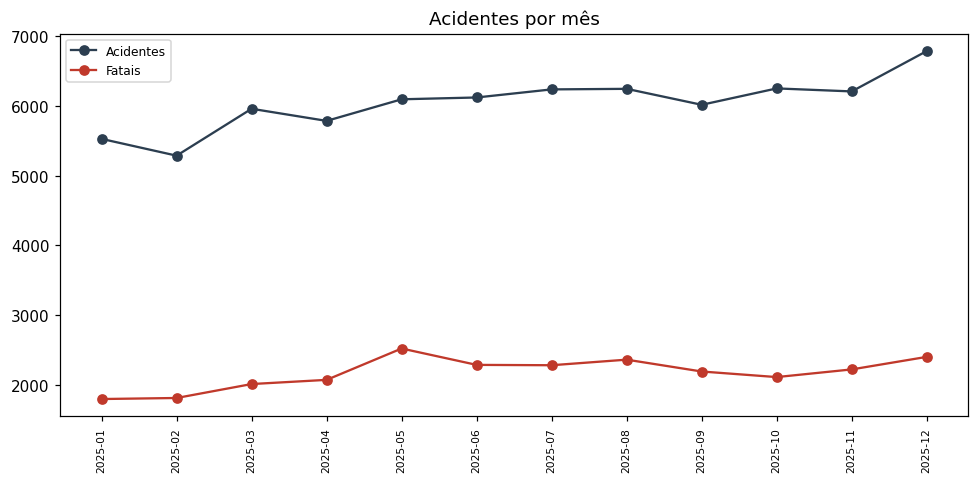

# Análise Exploratória de Dados - Acidentes PRF (2025)
**Autor:** José Guilherme Teixeira Nunes e Francisco Almeida Lucas De Farias Junior 

## 1. Dados de Referência: Estimativa Populacional por UF (2025)
A tabela abaixo consolida as estimativas populacionais do IBGE para o ano de 2025. Estes dados servirão unicamente como base comparativa para a análise extra no final deste documento.

| UF | População Estimada (2025) |
|---|---|
| SP | 46.081.801 |
| MG | 21.393.441 |
| RJ | 17.223.547 |
| BA | 14.870.907 |
| PR | 11.890.517 |
| RS | 11.233.263 |
| PE | 9.562.007 |
| CE | 9.268.836 |
| PA | 8.711.196 |
| SC | 8.187.029 |
| GO | 7.423.629 |
| MA | 7.018.211 |
| AM | 4.321.616 |
| PB | 4.164.468 |
| ES | 4.126.854 |
| MT | 3.893.659 |
| RN | 3.455.236 |
| PI | 3.384.547 |
| AL | 3.220.848 |
| DF | 2.996.899 |
| MS | 2.924.631 |
| SE | 2.299.425 |
| RO | 1.751.950 |
| TO | 1.586.859 |
| AC | 884.372 |
| AP | 806.517 |
| RR | 738.772 |

## 2. Frequências e Rankings (Volume vs. Proporção)

### 2.1. Ranking por UF (Volume de Acidentes e Gravidade)
Abaixo, a distribuição dos acidentes registrados pela PRF agrupados por Unidade da Federação, ordenados pelo volume total de ocorrências.

| UF | Acidentes Totais | Mortos | % de Fatalidade PRF |
|---|---|---|---|
| MG | 9.570 | 765 | 7% |
| SC | 8.186 | 434 | 5% |
| PR | 7.630 | 593 | 7% |
| RJ | 6.428 | 330 | 5% |
| RS | 4.899 | 327 | 6% |
| SP | 4.683 | 221 | 4% |
| BA | 4.108 | 583 | 12% |
| GO | 3.196 | 308 | 8% |
| PE | 3.013 | 336 | 10% |
| ES | 2.642 | 161 | 5% |
| MT | 2.636 | 243 | 8% |
| PB | 1.978 | 142 | 6% |
| MS | 1.654 | 150 | 8% |
| RN | 1.648 | 111 | 6% |
| PI | 1.490 | 168 | 10% |
| RO | 1.452 | 102 | 6% |
| CE | 1.302 | 171 | 12% |
| MA | 1.262 | 281 | 19% |
| PA | 1.117 | 224 | 17% |
| DF | 1.011 | 47 | 4% |
| TO | 677 | 102 | 12% |
| AL | 629 | 96 | 14% |
| SE | 589 | 51 | 7% |
| AC | 280 | 29 | 10% |
| AP | 169 | 14 | 5% |
| RR | 142 | 28 | 16% |
| AM | 138 | 26 | 14% |

**Análise:** Ao observar os dados da PRF de forma isolada, fica evidente que o ranking de volume não é ranking de fatalidade. O estado de Minas Gerais (MG) lidera de forma isolada em números absolutos de frequência, com 9.570 acidentes e 765 mortos (frequência de 7%). Santa Catarina (SC) e Paraná (PR) aparecem logo em seguida no volume de acidentes (8.186 e 7.630, respectivamente), mas mantêm taxas de fatalidade relativamente baixas (5% e 7%).
    
Por outro lado, ao investigar a gravidade relativa, o cenário muda drasticamente. O Maranhão (MA), mesmo ocupando apenas a 18ª posição em volume (1.262 acidentes), registra a maior proporção fatal do país: 19% dos acidentes resultam em mortes, configurando um ranking alternativo de proporção fatal. Pará (PA) e Roraima (RR) seguem a mesma tendência de altíssima letalidade, com 17% e 16%, respectivamente, apesar do menor número de registros totais.

 **Cautela Metodológica:** A alta fatalidade em locais como MA, PA e RR não deve ser interpretada somente como causalidade direta relacionada à localização. Essa proporção pode esconder dinâmicas de diferentes BRs, trechos específicos e etc.

### 2.2. Ranking por Rodovia (BR) - Top 15 em Volume
A tabela a seguir apresenta as 15 rodovias federais (BRs) com o maior número de acidentes registrados.

| BR | Acidentes | Mortos | Feridos | % Acidentes (Total) | % Fatalidade |
|---|---|---|---|---|---|
| BR-101 | 13.014 | 760 | 15.033 | 18% | 5% |
| BR-116 | 11.021 | 708 | 12.268 | 15% | 6% |
| BR-40 | 3.502 | 214 | 4.183 | 5% | 5% |
| BR-381 | 3.496 | 190 | 4.166 | 5% | 5% |
| BR-153 | 2.789 | 282 | 3.117 | 4% | 8% |
| BR-163 | 2.519 | 210 | 2.603 | 3% | 7% |
| BR-364 | 2.264 | 173 | 2.515 | 3% | 7% |
| BR-277 | 2.157 | 152 | 2.492 | 3% | 6% |
| BR-262 | 1.769 | 169 | 2.137 | 2% | 8% |
| BR-376 | 1.762 | 121 | 1.918 | 2% | 6% |
| BR-230 | 1.745 | 192 | 1.995 | 2% | 10% |
| BR-470 | 1.388 | 123 | 1.603 | 2% | 7% |
| BR-282 | 1.379 | 100 | 1.759 | 2% | 6% |
| BR-316 | 1.236 | 201 | 1.421 | 2% | 15% |
| BR-70 | 1.084 | 86 | 1.214 | 1% | 7% |

**Análise:** Analisando o volume, percebemos que as gigantes BR-101 e BR-116 acumulam, juntas, mais de 24 mil acidentes, liderando o ranking de frequência com uma vasta margem sobre as demais. Ambas concentram, sozinhas, cerca de um terço de todos os acidentes listados neste Top 15.

Entretanto, observando a severidade, a BR-316 desponta como um ponto de alerta operacional. Apesar de ocupar a 14ª posição em volume total (1.236 acidentes), ela detém a maior taxa de fatalidade da lista (15%). A BR-230 também chama atenção por apresentar um percentual de mortes (10%) acima da média das líderes.

**Cautela Metodológica:** A extensão territorial grandes de algumas rodovias contribui naturalmente para sua liderança em volume absoluto.

### 2.3. Ranking por Tipo de Acidente
O agrupamento por dinâmica (tipo) do acidente permite identificar as características mais comuns e aquelas mais perigosas nas rodovias.

| Tipo de Acidente | Acidentes | Mortos | Feridos | % Acidentes (Total) | % Fatalidade |
|---|---|---|---|---|---|
| Colisão traseira | 14.360 | 683 | 16.376 | 20% | 4% |
| Saída de leito carroçável | 10.209 | 700 | 11.638 | 14% | 6% |
| Colisão transversal | 9.306 | 481 | 12.015 | 13% | 5% |
| Colisão lateral mesmo sentido | 7.885 | 228 | 8.839 | 11% | 3% |
| Tombamento | 6.351 | 293 | 7.241 | 9% | 4% |
| Colisão com objeto | 5.109 | 323 | 4.952 | 7% | 6% |
| Colisão frontal | 4.739 | 1.863 | 7.596 | 7% | 29% |
| Queda de ocupante de veículo | 3.450 | 89 | 4.038 | 5% | 3% |
| Atropelamento de Pedestre | 3.057 | 919 | 2.846 | 4% | 30% |
| Colisão lateral sentido oposto | 2.152 | 255 | 2.824 | 3% | 10% |
| Incêndio | 1.771 | 0 | 55 | 2% | 0% |
| Capotamento | 1.373 | 74 | 1.827 | 2% | 5% |
| Engavetamento | 1.233 | 34 | 1.668 | 2% | 2% |
| Atropelamento de Animal | 1.133 | 74 | 1.267 | 2% | 6% |
| Eventos atípicos | 287 | 24 | 293 | 0% | 8% |
| Derramamento de carga | 107 | 3 | 69 | 0% | 3% |
| Sinistro pessoal de trânsito | 70 | 0 | 60 | 0% | 0% |

**Análise:** As colisões traseiras (14.360 registros) e as saídas de leito carroçável (10.209 registros) são os sinistros mais frequentes no dia a dia, indicando problemas comuns de distração ou distância de seguimento. Contudo, suas taxas de fatalidade são razoavelmente baixas (4% e 6%).

A priorização muda completamente ao avaliarmos a letalidade: atropelamentos de pedestres resultam em mortes em 30% das ocorrências, e as colisões frontais têm desfecho fatal em 29% das vezes. Estes dois tipos, embora menores em número absoluto que as batidas traseiras, exigem extrema priorização operacional e infraestrutural, dada sua altíssima proporção fatal.

**Cautela Metodológica:** A disparidade nos mostra que não se pode utilizar a métrica de "volume" para sinalizar "risco" de forma generalizada. Um trecho com alto volume de engavetamentos e colisões laterais trará grandes impactos no fluxo de trânsito, mas um trecho com recorrência de colisões frontais ceifará muito mais vidas.

## 3. Série Temporal Simples (Acidentes e Fatalidades - 2025)
Abaixo está o registro da evolução mensal de acidentes e ocorrências fatais ao longo do ano.

| Mês | Acidentes | Acidentes Fatais | Mortos | Feridos | % Fatalidade |
|---|---|---|---|---|---|
| 2025-01 | 5.528 | 359 | 418 | 6.915 | 6% |
| 2025-02 | 5.287 | 362 | 412 | 5.974 | 7% |
| 2025-03 | 5.960 | 402 | 462 | 6.784 | 7% |
| 2025-04 | 5.786 | 414 | 495 | 6.678 | 7% |
| 2025-05 | 6.096 | 504 | 574 | 6.834 | 8% |
| 2025-06 | 6.122 | 457 | 528 | 6.920 | 7% |
| 2025-07 | 6.238 | 456 | 536 | 7.129 | 7% |
| 2025-08 | 6.246 | 472 | 554 | 7.006 | 8% |
| 2025-09 | 6.017 | 438 | 500 | 6.876 | 7% |
| 2025-10 | 6.252 | 422 | 494 | 7.231 | 7% |
| 2025-11 | 6.209 | 444 | 498 | 7.103 | 7% |
| 2025-12 | 6.788 | 480 | 572 | 8.100 | 7% |

**Análise Visual:** A representação gráfica evidencia o distanciamento absoluto entre o volume total de ocorrências (linha superior escura) e a quantidade de acidentes com desfecho fatal (linha inferior vermelha). Fica claro que a curva de fatalidades possui uma variância muito menor e mais "achatada" do que a curva de acidentes totais. 

Mesmo quando os acidentes totais sofrem uma queda visível em fevereiro ou assumem uma forte tendência de alta a partir de setembro (culminando no pico de dezembro), a linha de fatalidades se mantém em um patamar quase constante. Os leves "degraus" de elevação nas ocorrências fatais observados visualmente em maio e dezembro reforçam que a severidade possui uma dinâmica própria, não sendo um mero reflexo espelhado do aumento ou diminuição do volume de tráfego geral.

**Análise:** A evolução temporal apresenta picos de volume absoluto em meses tradicionalmente associados a férias escolares, turismo e festividades: julho (6.238), outubro (6.252) e dezembro, que lidera o ranking de volume com 6.788 ocorrências e 572 óbitos.

Apesar das flutuações no volume, a gravidade se manteve surpreendentemente constante (em torno de 7% de letalidade), com ligeiros picos de 8% nos meses de maio e agosto. Isso indica que os aumentos em números absolutos de mortos acompanham proporcionalmente o aumento global do fluxo e acidentes, não demonstrando uma mudança na característica ou letalidade inerente aos acidentes durante os feriados.

**Cautela Metodológica:** Devemos ser estritamente cuidadosos ao interpretar essas variações: uma série simples não prova tendência nem efeito de política pública. Este recorte temporal descreve um comportamento estático do ano (variações e sazonalidade aparente), mas não explica causalidade isoladamente.

## 4. Análise Extra: Comparativo População vs. Gravidade dos Acidentes
Cruzando a base populacional (Seção 1) com os indicadores da PRF (Seção 2.1), notam-se disparidades importantes entre a exposição demográfica e a letalidade nas rodovias federais.
    
O estado com o maior contingente populacional do país, São Paulo, com mais de 46 milhões de habitantes, não lidera o volume absoluto de acidentes nas rodovias federais (4.683 ocorrências) e, mais notavelmente, possui o menor percentual de fatalidade (apenas 4%). 

Em contraste, estados das regiões Norte e Nordeste, como o Maranhão (população de ~7 milhões) e o Pará (população de ~8,7 milhões), despontam com os maiores percentuais de fatalidade da PRF (19% e 17%), mesmo com populações consideravelmente menores. Isso reforça a premissa de que a densidade populacional, por si só, não explica a gravidade das ocorrências rodoviárias, sendo necessário investigar elementos operacionais e logísticos nesses estados de alta letalidade.
